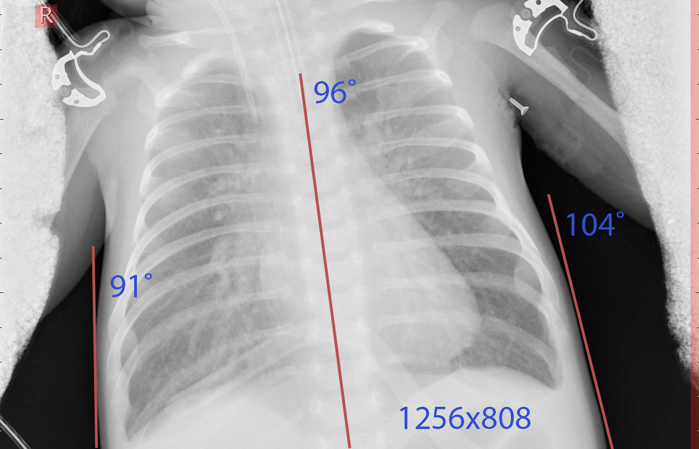
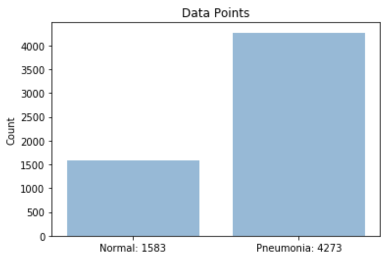
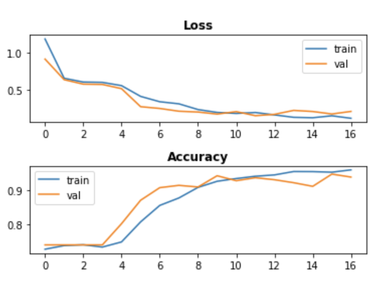
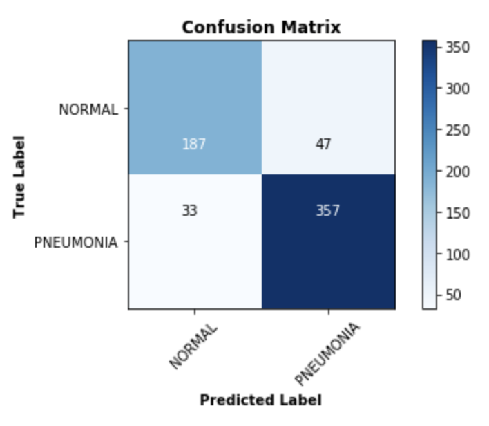

# Table of Contents

1. [EDA](#eda)  
    1. [Viewing Images](#view)  
    2. [Class Distribution](#class)  
2. [Modeling](#modeling)  
    1. [Tuning One Parameter](#one)  
    2. [Complex Models](#complex)  
    3. [Final Model](#final)  
3. [Results](#results)

# EDA 

## Viewing Images 

In this project, we are working with images of chest X-rays which we are classifying into two categories: pneumonia or normal. First, let's look at the difference between these.

#### Normal:
<table style="border-collapse: collapse;">
    <tr>
        <td style="border: none;"></td>
        <td style="border: none;"></td>
        <td style="border: none;"></td>
    </tr>
</table>

#### Pneumonia:
<table style="border-collapse: collapse;">
    <tr>
        <td style="border: none;"></td>
        <td style="border: none;"></td>
        <td style="border: none;"></td>
    </tr>
</table>

From <a href="https://www.radiologyinfo.org/en/info.cfm?pg=pneumonia">Radiology.org</a>:   _Pneumonia is an infection that causes inflammation in one or both of the lungs. It can be caused by a virus, bacteria, fungi or other germs. The infection is usually acquired when a person breathes in air carrying germs._

When radiologists look at these images, they look for white spots called infiltrates that identify an infection, as well as abscesses or fluids that could be caused by pneumonia. We find it a bit difficult to tell the difference between these due to not being trained radiologists, but we can definitely say some x-rays (such as the leftmost pneumonia picture above) look more "cloudy" than others.

Further reviewing our data, we can see that:
* Every image is grayscale, only containing color data in the gray channel (as opposed to RGB alpha channels).
* Each image has a different pixel dimension, many with non-square aspect ratios. 
* Most images have tick marks on the left and right edges.
* Many images contain other text near the edges.
* Some images show the patient rotated at an angle.

To remedy any issues caused by this, we will change parameters of ImageDataGenerator while creating our models.

## Class Distribution 

Before we start modeling, we want to check for class imbalance. 

We can see we have a 27:73 split. This isn't a huge imbalance, but definitely something to keep in mind when evaluating our models, as our null accuracy is 73%. This is the accuracy we could achieve by always predicting the most frequent class.

# Modeling 

## Tuning One Parameter 
First, we experiment to see how changing parameters in our data and models affects our results. To see this process, go to the “Tuning_One_Parameter” jupyter notebook. 

Below are the parameters we found to give us better results:
* Early Stopping with a higher patience
* Additional layers
* Dropout before flatten layer
* Image Transformations (Zoom, Shear, and Shift)
* Larger Image

## Complex Models 

To find our best model, we used a mix of these best parameters. This process is in the "Complex_Models" jupyter notebook.

Our best model had the following parameters:
* 6x6 and 5x5 layer
    * Helps us extract more features and patterns
* 128x128 images
    * The largest images we could give our model with our current hardware 
* Quad filters
    * 
* Dropout before flatten
    * Helps avoid overfitting
* Shift, Shear and Zoom on training set
    * Zoom removes the majority of ticks and edges we previously mentioned were on some pictures
    * Shear accounts for rotation of patients in some X-rays
    * Shift accounts for non-centered images
    * Helps us avoid overfitting to our training set's images

# Results 

Let's look at the results of our best model in detail below.

**Accuracy**: Train - 0.938, Test - 0.872  
**Loss**: Train - 0.158, Test - 0.321 
 
These were the best accuracy and loss results for our test set out of all the models we ran.

We can see here that the validation set loss and accuracy follows the same improving trend as that of the training set, meaning we have a good fit on our data.

    <strong>Precision</strong>: Normal - 0.85, Pneumonia - 0.88  
    <strong>Recall</strong>: Normal - 0.80, Pneumonia - 0.92  
    <strong>F1 Score</strong>: Normal - 0.82, Pneumonia - 0.90    

    

The confusion matrix shows us that we have a low amount of false negatives/positives. We are able to keep recall above 0.90 while still have a high precision, giving us a high f1 score. Since this model is making predictions on people's medical diagnosis, we need to be sure to prioritize recall. We'd rather someone healthy get checked for pneumonia than someone sick be misdiagnosed as healthy.

Let's take a look at some examples of images classified by our model.

[stuff from classification notebook]

Overall, our model gives us good results!